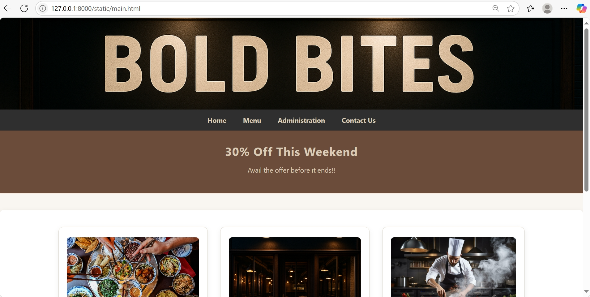
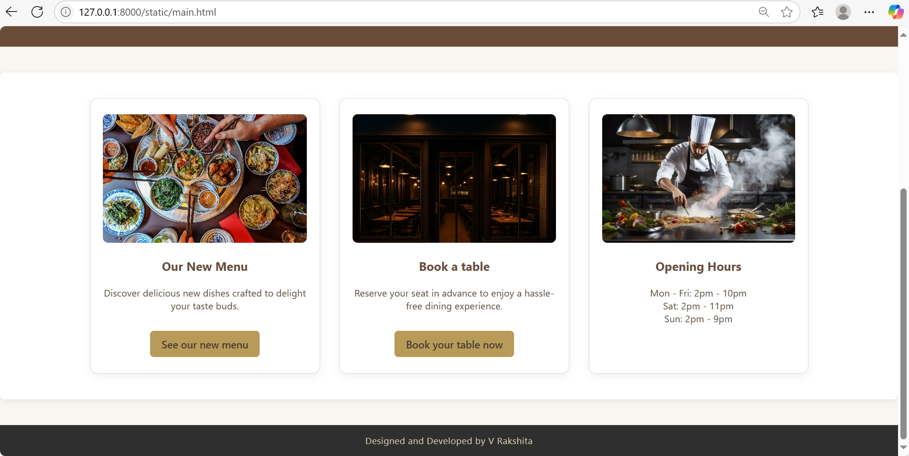
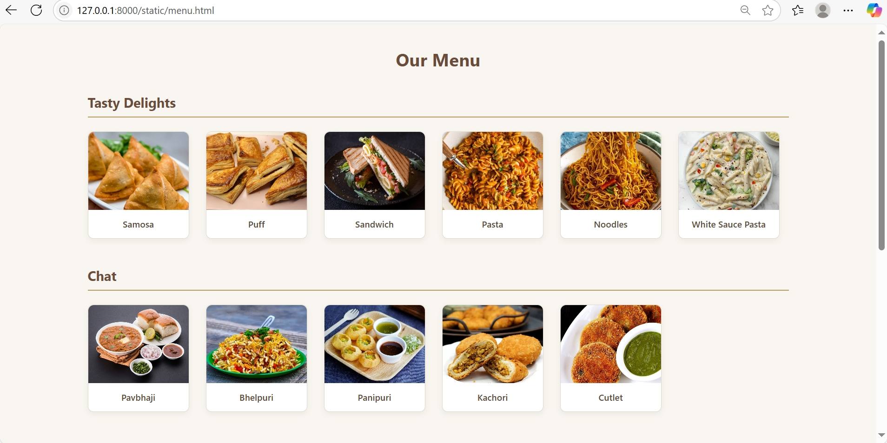
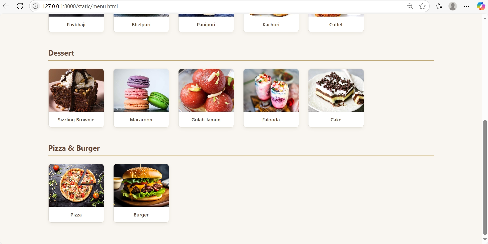
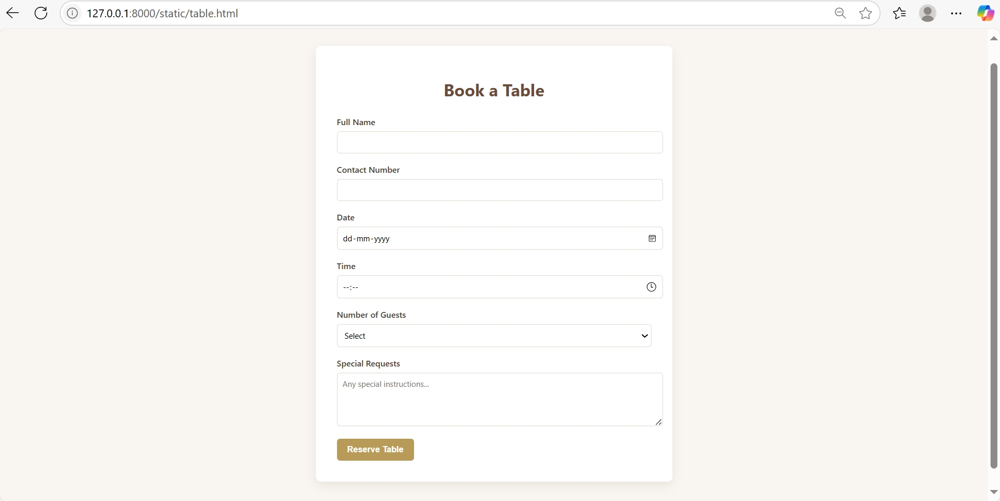
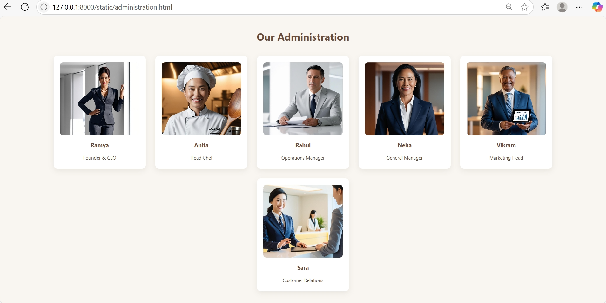
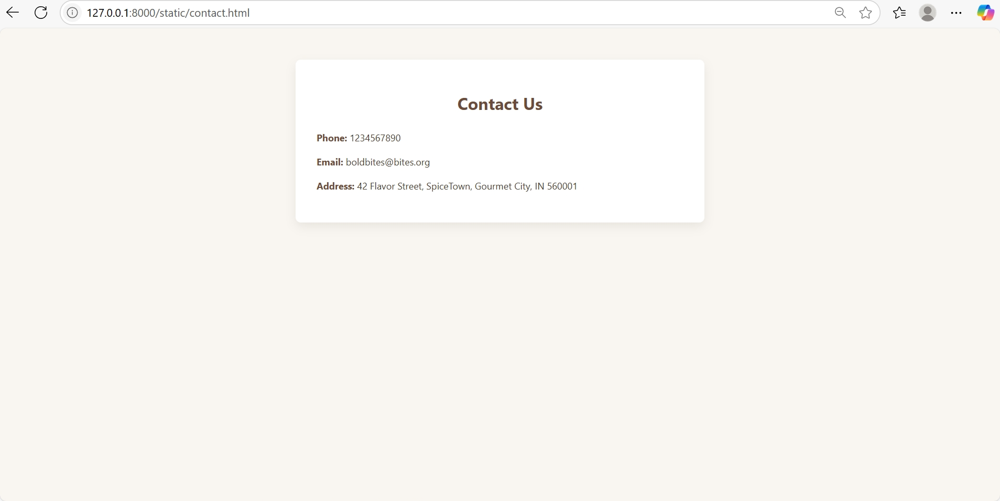
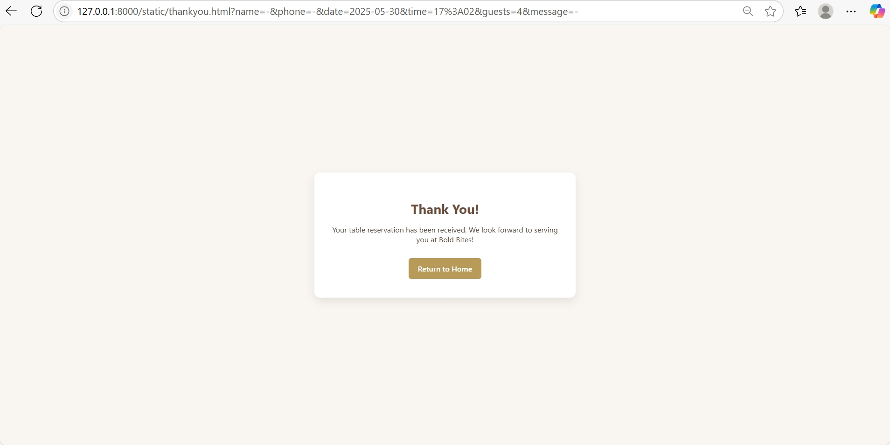

# Ex.07 Restaurant Website
## Date: 16.05.2025

## AIM:
To develop a static Restaurant website to display the food items and services provided by them.

## DESIGN STEPS:

### Step 1:
Requirement collection.

### Step 2:
Creating the layout using HTML and CSS.

### Step 3:
Updating the sample content.

### Step 4:
Choose the appropriate style and color scheme.

### Step 5:
Validate the layout in various browsers.

### Step 6:
Validate the HTML code.

### Step 7:
Publish the website in the given URL.

## PROGRAM:

main.html
```html
<!DOCTYPE html>
<html lang="en">

<head>
    <meta charset="UTF-8" />
    <meta name="viewport" content="width=device-width, initial-scale=1" />
    <title>Bold Bites</title>
    <style>
        body {
            font-family: 'Segoe UI', Tahoma, Geneva, Verdana, sans-serif;
            margin: 0;
            padding: 0;
            background-color: #f9f6f1;
            /* warm off-white */
            color: #4a3c31;
            /* dark warm brown */
        }

        header {
            width: 100%;
            height: 220px;
            overflow: hidden;
        }

        header img {
            width: 100%;
            height: auto;
            object-fit: cover;
            object-position: center top;
            transform: scale(1.05) translateY(-8%);
        }

        nav {
            background-color: #2f2f2f;
            /* charcoal */
            display: flex;
            justify-content: center;
            gap: 40px;
            padding: 15px 0;
        }

        nav a {
            color: #d9cbb6;
            /* beige */
            text-decoration: none;
            font-weight: bold;
            font-size: 16px;
            transition: color 0.3s;
        }

        nav a:hover {
            color: #b89b59;
            /* muted gold */
        }

        .banner {
            background-color: #6b4c3b;
            /* deep warm brown */
            color: #d9cbb6;
            /* beige */
            text-align: center;
            padding: 30px 20px;
        }

        .highlight {
            font-size: 28px;
            font-weight: bold;
            letter-spacing: 1px;
        }

        .container {
            display: flex;
            justify-content: space-between;
            flex-wrap: wrap;
            padding: 40px 10%;
            background-color: #fff;
            gap: 30px;
            border-radius: 8px;
            box-shadow: 0 2px 10px rgba(74, 60, 49, 0.1);
            margin: 40px auto;
            max-width: 1200px;
        }

        .card {
            flex: 1 1 300px;
            background-color: #fff;
            padding: 25px 20px;
            border: 1px solid #e0d9ce;
            border-radius: 12px;
            text-align: center;
            box-shadow: 0 4px 12px rgba(74, 60, 49, 0.08);
            transition: transform 0.3s ease;
        }

        .card:hover {
            transform: translateY(-5px);
            box-shadow: 0 8px 18px rgba(74, 60, 49, 0.15);
        }

        .card img {
            width: 100%;
            height: 200px;
            object-fit: cover;
            border-radius: 8px;
        }

        .card h3 {
            color: #6b4c3b;
            /* deep brown */
            margin-top: 20px;
            font-weight: 700;
        }

        .card p {
            font-size: 15px;
            margin: 15px 0 20px;
            color: #5a4a3a;
        }

        .card a.button {
            display: inline-block;
            margin-top: 10px;
            color: #4a3c31;
            /* dark brown */
            background-color: #b89b59;
            /* muted gold */
            padding: 10px 18px;
            border-radius: 6px;
            text-decoration: none;
            font-weight: 600;
            transition: background-color 0.3s ease;
        }

        .card a.button:hover {
            background-color: #9a8244;
            color: #fff;
        }

        /* NEW: Opening Hours card size & centering */
        .container .card:nth-child(3) {
            max-width: 300px;
            margin-left: auto;
            margin-right: auto;
        }

        footer {
            text-align: center;
            padding: 15px;
            background-color: #2f2f2f;
            color: #d9cbb6;
            font-size: 14px;
            margin-top: 40px;
            letter-spacing: 0.5px;
        }

        @media (max-width: 768px) {
            .container {
                padding: 20px 5%;
                gap: 20px;
            }

            .card {
                flex: 1 1 100%;
            }
        }
    </style>
</head>

<body>
    <header>
        
    </header>

    <nav>
        <a href="#">Home</a>
        <a href="menu.html">Menu</a>
        <a href="administration.html">Administration</a>
        <a href="contact.html">Contact Us</a>
    </nav>

    <div class="banner">
        <div class="highlight">30% Off This Weekend</div>
        <p>
            Avail the offer before it ends!!
        </p>
    </div>

    <div class="container">
        <div class="card">
            
            <h3>Our New Menu</h3>
            <p>Discover delicious new dishes crafted to delight your taste buds.</p>
            <a class="button" href="menu.html">See our new menu</a>
        </div>

        <div class="card">
            
            <h3>Book a table</h3>
            <p>Reserve your seat in advance to enjoy a hassle-free dining experience.</p>
            <a class="button" href="table.html">Book your table now</a>
        </div>

        <div class="card">
            
            <h3>Opening Hours</h3>
            <p>
                Mon - Fri: 2pm - 10pm<br />
                Sat: 2pm - 11pm<br />
                Sun: 2pm - 9pm
            </p>
        </div>
    </div>

    <footer>
        Designed and Developed by V Rakshita
    </footer>
</body>

</html>
```

menu.html
```html
<!DOCTYPE html>
<html lang="en">

<head>
    <meta charset="UTF-8" />
    <meta name="viewport" content="width=device-width, initial-scale=1" />
    <title>Bold Bites - Menu</title>
    <style>
        body {
            font-family: 'Segoe UI', Tahoma, Geneva, Verdana, sans-serif;
            background-color: #f9f6f1;
            color: #4a3c31;
            margin: 0;
            padding: 20px 10%;
        }

        h1 {
            text-align: center;
            color: #6b4c3b;
            margin-bottom: 40px;
        }

        .category {
            margin-bottom: 50px;
        }

        .category h2 {
            border-bottom: 2px solid #b89b59;
            padding-bottom: 10px;
            margin-bottom: 25px;
            color: #6b4c3b;
        }

        .items {
            display: flex;
            flex-wrap: wrap;
            gap: 30px;
            justify-content: flex-start;
        }

        .item {
            width: 180px;
            text-align: center;
            border: 1px solid #e0d9ce;
            border-radius: 10px;
            background: white;
            box-shadow: 0 4px 10px rgba(74, 60, 49, 0.08);
            transition: transform 0.3s ease;
            cursor: pointer;
        }

        .item:hover {
            transform: translateY(-5px);
            box-shadow: 0 8px 18px rgba(74, 60, 49, 0.15);
        }

        .item img {
            width: 100%;
            height: 140px;
            object-fit: cover;
            border-radius: 10px 10px 0 0;
        }

        .item p {
            margin: 10px 0 15px;
            font-weight: 600;
            color: #5a4a3a;
        }

        @media (max-width: 600px) {
            body {
                padding: 15px 5%;
            }

            .items {
                justify-content: center;
            }

            .item {
                width: 100%;
                max-width: 300px;
            }
        }
    </style>
</head>

<body>
    <h1>Our Menu</h1>

    <!-- Tasty Delights Section -->
    <section class="category">
        <h2>Tasty Delights</h2>
        <div class="items">
            <div class="item">
                <p>Samosa</p>
            </div>
            <div class="item">
                <p>Puff</p>
            </div>
            <div class="item">
                <p>Sandwich</p>
            </div>
            <div class="item">
                <p>Pasta</p>
            </div>
            <div class="item">
                <p>Noodles</p>
            </div>
            <div class="item">
                <p>White Sauce Pasta</p>
            </div>
        </div>
    </section>

    <!-- Chat Section -->
    <section class="category">
        <h2>Chat</h2>
        <div class="items">
            <div class="item">
                <p>Pavbhaji</p>
            </div>
            <div class="item">
                <p>Bhelpuri</p>
            </div>
            <div class="item">
                <p>Panipuri</p>
            </div>
            <div class="item">
                <p>Kachori</p>
            </div>
            <div class="item">
                <p>Cutlet</p>
            </div>
        </div>
    </section>

    <!-- Dessert Section -->
    <section class="category">
        <h2>Dessert</h2>
        <div class="items">
            <div class="item">
                <p>Sizzling Brownie</p>
            </div>
            <div class="item">
                <p>Macaroon</p>
            </div>
            <div class="item">
                <p>Gulab Jamun</p>
            </div>
            <div class="item">
                <p>Falooda</p>
            </div>
            <div class="item">
                <p>Cake</p>
            </div>
        </div>
    </section>

    
    <section class="category">
        <h2>Pizza & Burger</h2>
        <div class="items">
            <div class="item">
                <p>Pizza</p>
            </div>
            <div class="item">
                <p>Burger</p>
            </div>
        </div>
    </section>

</body>

</html>
```
table.html
```html
<!DOCTYPE html>
<html lang="en">

<head>
    <meta charset="UTF-8" />
    <meta name="viewport" content="width=device-width, initial-scale=1" />
    <title>Book a Table - Bold Bites</title>
    <style>
        body {
            font-family: 'Segoe UI', Tahoma, Geneva, Verdana, sans-serif;
            background-color: #f9f6f1;
            color: #4a3c31;
            margin: 0;
            padding: 20px;
        }

        .container {
            max-width: 600px;
            margin: 50px auto;
            background: white;
            padding: 40px;
            border-radius: 10px;
            box-shadow: 0 8px 20px rgba(74, 60, 49, 0.1);
        }

        h1 {
            text-align: center;
            color: #6b4c3b;
            margin-bottom: 30px;
        }

        label {
            display: block;
            margin-bottom: 8px;
            font-weight: 600;
        }

        input,
        select,
        textarea {
            width: 100%;
            padding: 10px;
            margin-bottom: 20px;
            border: 1px solid #e0d9ce;
            border-radius: 6px;
            font-size: 15px;
            font-family: inherit;
        }

        textarea {
            resize: vertical;
            min-height: 80px;
        }

        button {
            background-color: #b89b59;
            color: #fff;
            border: none;
            padding: 12px 20px;
            font-size: 16px;
            font-weight: 600;
            border-radius: 6px;
            cursor: pointer;
            transition: background-color 0.3s ease;
        }

        button:hover {
            background-color: #9a8244;
        }

        @media (max-width: 600px) {
            .container {
                padding: 25px;
            }
        }
    </style>
</head>

<body>
    <div class="container">
        <h1>Book a Table</h1>
        <form action="thankyou.html" method="GET">
            <label for="name">Full Name</label>
            <input type="text" id="name" name="name" required />

            <label for="phone">Contact Number</label>
            <input type="tel" id="phone" name="phone" required />

            <label for="date">Date</label>
            <input type="date" id="date" name="date" required />

            <label for="time">Time</label>
            <input type="time" id="time" name="time" required />

            <label for="guests">Number of Guests</label>
            <select id="guests" name="guests" required>
                <option value="">Select</option>
                <option value="1">1 Person</option>
                <option value="2">2 People</option>
                <option value="3">3 People</option>
                <option value="4">4 People</option>
                <option value="5">5 People</option>
                <option value="6">6+ People</option>
            </select>

            <label for="message">Special Requests</label>
            <textarea id="message" name="message" placeholder="Any special instructions..."></textarea>

            <button type="submit">Reserve Table</button>
        </form>
    </div>
</body>

</html>
```
thankyou.html
```
<!DOCTYPE html>
<html lang="en">

<head>
    <meta charset="UTF-8" />
    <meta name="viewport" content="width=device-width, initial-scale=1" />
    <title>Thank You - Bold Bites</title>
    <style>
        body {
            font-family: 'Segoe UI', Tahoma, Geneva, Verdana, sans-serif;
            background-color: #f9f6f1;
            color: #4a3c31;
            display: flex;
            justify-content: center;
            align-items: center;
            height: 100vh;
            margin: 0;
            text-align: center;
        }

        .thank-you-box {
            background: white;
            padding: 40px 30px;
            border-radius: 12px;
            box-shadow: 0 8px 20px rgba(74, 60, 49, 0.12);
            max-width: 500px;
        }

        h1 {
            color: #6b4c3b;
            font-size: 28px;
            margin-bottom: 15px;
        }

        p {
            font-size: 16px;
            margin-bottom: 30px;
            color: #5a4a3a;
        }

        a.button {
            display: inline-block;
            background-color: #b89b59;
            color: #fff;
            padding: 12px 20px;
            border-radius: 6px;
            text-decoration: none;
            font-weight: 600;
            transition: background-color 0.3s ease;
        }

        a.button:hover {
            background-color: #9a8244;
        }
    </style>
</head>

<body>
    <div class="thank-you-box">
        <h1>Thank You!</h1>
        <p>Your table reservation has been received. We look forward to serving you at Bold Bites!</p>
        <a class="button" href="main.html">Return to Home</a>
    </div>
</body>

</html>
```
administration.html
```html
<!DOCTYPE html>
<html lang="en">

<head>
    <meta charset="UTF-8" />
    <meta name="viewport" content="width=device-width, initial-scale=1" />
    <title>Administration - Bold Bites</title>
    <style>
        body {
            font-family: 'Segoe UI', Tahoma, Geneva, Verdana, sans-serif;
            background-color: #f9f6f1;
            color: #4a3c31;
            margin: 0;
            padding: 20px;
        }

        h1 {
            text-align: center;
            color: #6b4c3b;
            margin-bottom: 40px;
        }

        .team {
            display: flex;
            flex-wrap: wrap;
            gap: 30px;
            justify-content: center;
        }

        .member {
            background-color: white;
            width: 250px;
            text-align: center;
            border-radius: 12px;
            padding: 20px;
            box-shadow: 0 6px 18px rgba(74, 60, 49, 0.1);
            transition: transform 0.3s ease;
        }

        .member:hover {
            transform: translateY(-5px);
            box-shadow: 0 10px 20px rgba(74, 60, 49, 0.2);
        }

        .member img {
            width: 100%;
            height: 230px;
            object-fit: cover;
            border-radius: 10px;
        }

        .member h3 {
            margin-top: 15px;
            color: #6b4c3b;
            font-size: 18px;
        }

        .member p {
            margin: 5px 0;
            color: #5a4a3a;
            font-size: 15px;
        }

        @media (max-width: 600px) {
            .member {
                width: 100%;
                max-width: 300px;
            }
        }
    </style>
</head>

<body>
    <h1>Our Administration</h1>

    <div class="team">
        <div class="member">
            
            <h3>Ramya</h3>
            <p>Founder & CEO</p>
        </div>
        <div class="member">
            
            <h3>Anita</h3>
            <p>Head Chef</p>
        </div>
        <div class="member">
            
            <h3>Rahul</h3>
            <p>Operations Manager</p>
        </div>
        <div class="member">
            
            <h3>Neha</h3>
            <p>General Manager</p>
        </div>
        <div class="member">
            
            <h3>Vikram</h3>
            <p>Marketing Head</p>
        </div>
        <div class="member">
            
            <h3>Sara</h3>
            <p>Customer Relations</p>
        </div>
    </div>
</body>

</html>
```
contact.html
```html
<!DOCTYPE html>
<html lang="en">

<head>
    <meta charset="UTF-8" />
    <meta name="viewport" content="width=device-width, initial-scale=1" />
    <title>Contact Us - Bold Bites</title>
    <style>
        body {
            font-family: 'Segoe UI', Tahoma, Geneva, Verdana, sans-serif;
            background-color: #f9f6f1;
            color: #4a3c31;
            margin: 0;
            padding: 0;
        }

        .container {
            max-width: 700px;
            margin: 60px auto;
            background-color: #ffffff;
            padding: 40px;
            border-radius: 10px;
            box-shadow: 0 8px 20px rgba(74, 60, 49, 0.1);
        }

        h1 {
            text-align: center;
            color: #6b4c3b;
            margin-bottom: 30px;
        }

        .info {
            font-size: 18px;
            line-height: 1.7;
        }

        .info p {
            margin: 15px 0;
        }

        .info strong {
            color: #6b4c3b;
        }

        .map {
            margin-top: 30px;
            border-radius: 8px;
            overflow: hidden;
            height: 300px;
            border: 1px solid #ddd2c2;
        }

        @media (max-width: 600px) {
            .container {
                padding: 25px;
            }

            .map {
                height: 200px;
            }
        }
    </style>
</head>

<body>
    <div class="container">
        <h1>Contact Us</h1>
        <div class="info">
            <p><strong>Phone:</strong> 1234567890</p>
            <p><strong>Email:</strong> boldbites@bites.org</p>
            <p><strong>Address:</strong> 42 Flavor Street, SpiceTown, Gourmet City, IN 560001</p>
</body>

</html>
```

## OUTPUT:









    





   

## RESULT:
The program for designing software company website using HTML and CSS is completed successfully.
